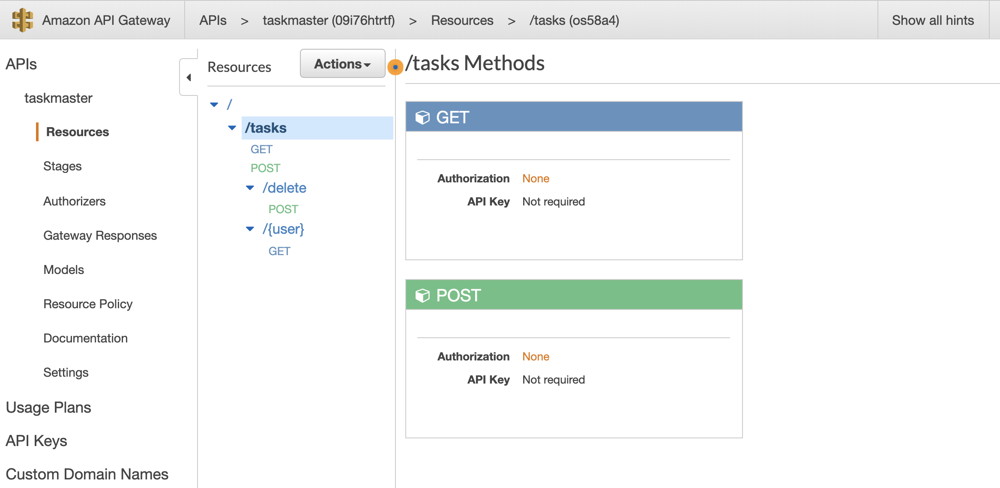
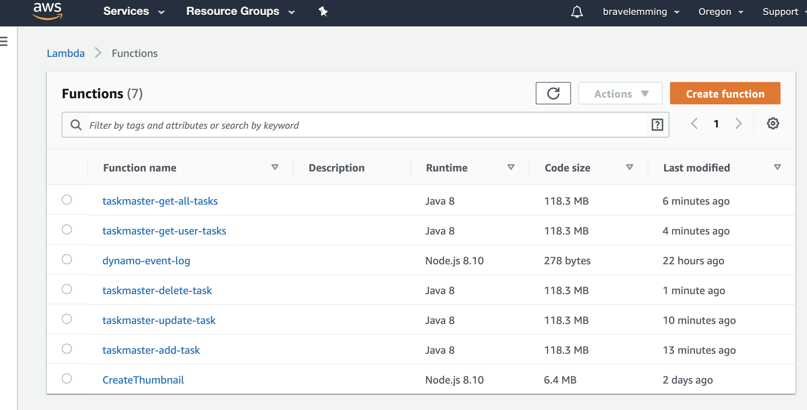
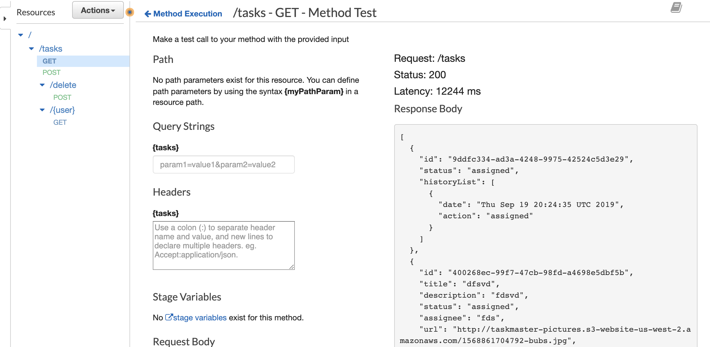

# lambdaDynamo plus CRUD
Author: Jack Daniel Kinne.
Challenge by: Codefellows.
<!-- Short summary or background information -->
- write a lambda to add records when pictures are added to an S3 bucket.
- write unique functions for FULL crud

## link to frontend:
[front_end](http://taskmaster-frontend-jack.s3-website-us-west-2.amazonaws.com/)

## Challenge
<!-- Description of the challenge -->
- Create a lambda function, in Java, that can add a record to your Taskmaster table.
- Run this only in “Test” mode
- It should receive the same object that your API was handling earlier.
- Repeat for “PUT” / update functionality
- Do NOT handle images at this point.
- You might want to keep this warm…
- Get all Tasks
- Get tasks for a user
- Create New Task
- Delete Task
- Update Task State
- Change Task Assignee
## Approach & Efficiency
<!-- What approach did you take? Why? What is the Big O space/time for this approach? -->
- write functions
- push into separate lambdas
- associate lambdas with an api gateway


## credits and contributions
- Matt Stuhring
- Nhu Trinh
- @Bomibear
- Travis Cox
- Peter Lee
- Padmapriya Gannapathi
- Renee Messick
- Jack Kinne
- Marisha Hoza
- Jane Hur

## test cases
- unique test for update
```
{
  "id": "463ad2fe-19c7-460b-8f2b-a7b33bf67b68",
  "title": "wednesdayLambda",
  "description": "lambda dynamo test",
  "assignee": "FLUFFY, DESTROYER OF CABINETS"
}
```
- test for create
```
{
  "title": "wednesdayLambda",
  "description": "lambda dynamo test",
  "assignee": "FLUFFY, DESTROYER OF CABINETS"
}
```

## API Gateway routes


## Lambda Function list


## API Get route return test


